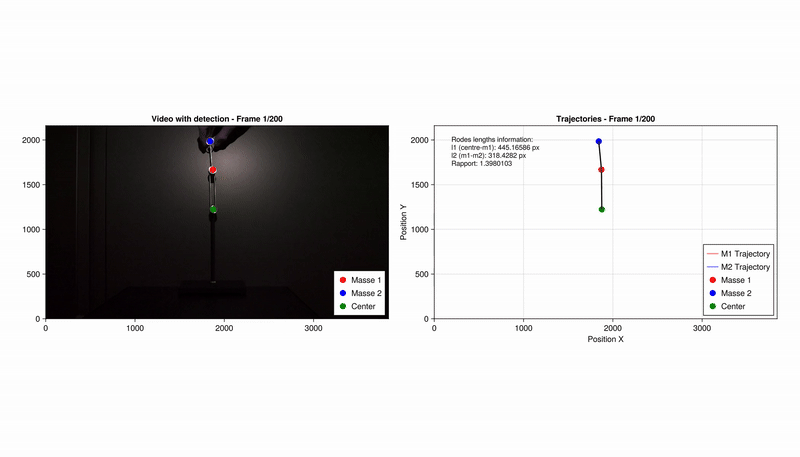

# Context
Simulation of a double pendulum and detection of a double pendulum from a 2-second video, with the goal of predicting the continuation of this video.
Firstly, a double pendulum simulation is available under `doublePendulum_v1.jl`. It can be called from `main.jl` by setting the masses and the rod lengths.

## Double pendulum simulation

## Video detection

## TODO 
1) Extract all the information from the video.
2) Find a way to minimize the error of the simulation based on the known information from the video.
3) Simulate the continuation of the video.

# Double Pendulum - Computer Physics 1 Project

## General Description
This project simulates and optimizes a double pendulum using real video data.

## Project Structure

### **accelerations.jl**
**Description:** Computes angular accelerations a1 and a2 for the double pendulum from motion equations derived from Newtonian mechanics.
**Functionality:** 
- Implementation of double pendulum differential equations
- Handling of degenerate cases (near-zero denominator)
**Output:** Returns angular accelerations a1 and a2.

### **doublePendulum_v1.jl**
**Description:** Numerical simulation of the double pendulum using simple Euler integration.
**Functionality:** 
- Time integration with fixed step (dt=0.01s)
- Polar/cartesian coordinate conversion
- Angle normalization to avoid jumps
- Storage of positions, angles, and angular velocities
**Output:** Complete time series of simulated motion.

### **animationV1.jl**
**Description:** Generates a double pendulum animation using GLMakie. Optimized version for increased performance.
**Functionality:** 
- Real-time animation of double pendulum motion
- Display of simulation parameters
- Visualization of rods and masses
- Video format recording
**Output:** Animation video of the simulated pendulum.

### **image_video.jl**
**Description:** Video processing to detect and track positions of two masses in an experimental video.
**Functionality:** 
- Video frame extraction
- Color masking for orange mass detection
- Centroid calculation and consistent reordering between frames
- Pivot point (center) determination
- Rod length calculation in pixels
- Interactive tracking animation
- θ1 and θ2 angle calculation from positions
**Output:** Positions, angles, and lengths extracted from video.

### **optimization.jl**
**Description:** Main optimization file that coordinates the entire process. It loads video data, defines error functions, executes optimization in two phases (broad search then refinement), and generates final visualizations.
**Functionality:** 
- Video data loading and caching
- Weighted error calculation between simulation and video
- Two-phase optimization over 6 parameters (m1, m2, l1, l2, w1, w2)
- Comparative visualization with GLMakie
- Animation and comparison video generation
**Output:** Optimized double pendulum parameters and comparative visualizations.

### **comparison_video.jl**
**Description:** Creates a side-by-side comparison video between video tracking and optimized simulation.
**Functionality:** 
- Loading video data from cache
- Running simulation with optimized parameters
- Simultaneous display of both systems
- Recent trajectory trails
- Video recording with error handling
**Output:** Comparison video showing optimization quality.

### **main.jl**
**Description:** Main entry point of the project. Orchestrates the entire process: simulation, video analysis, optimization, and energy analysis.
**Functionality:** 
- Initial simulation with default parameters
- Video analysis and cache loading
- Optimization process call
- Future motion prediction
- Energy analysis (kinetic, potential, total)
- Energy curve visualization
**Output:** Complete pipeline execution and generation of all results.

## Dependencies
- Julia
- GLMakie (for visualization)
- JLD2 (for data caching)
- VideoIO (for video processing)
- ImageMorphology (for image processing)
- GeometryBasics, Colors, Statistics

## Usage
1. Run `main.jl` to execute the complete pipeline
2. Place your input video as `First_Video_2s.mp4` in the project directory
3. The optimization will create cache files and output videos in the `videos/` directory
4. Results include optimized parameters, comparison plots, and energy analysis

## Output Files
- `pendulumV1.mp4`: Initial simulation animation
- `pendulumOptimized.mp4`: Optimized simulation animation
- `comparison_tracking_vs_simulation.mp4`: Side-by-side comparison
- `comparison_phase1.png`: Phase 1 optimization results
- `comparison_final.png`: Final optimization results
- `energies_optimized.png`: Energy analysis plot
- `video_data_cache.jld2`: Cached video data

## Video
The project processes experimental video data to extract pendulum motion and compares it with numerical simulations.